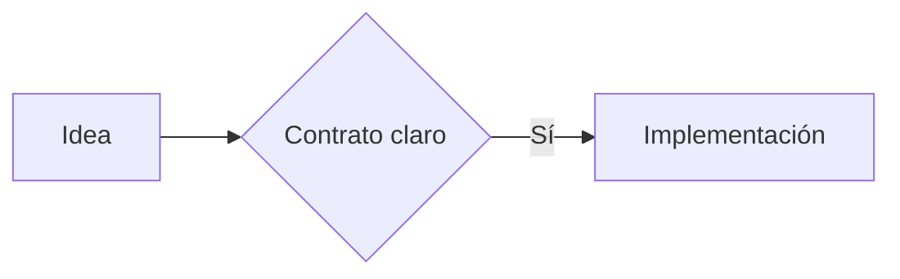

# Working Backwards in T3 Code

Start with a non-technical Product Grill With Docs, then work backwards from the finished customer experience. Accept an ordinary sentence; never require a structured mega-prompt. T3 Code is the conversational and execution surface. HumanLayer is not required.

## Create the workspace

Resolve the Git repository root, normalized remote, and exact `git rev-parse HEAD`. Derive short path-safe repository and feature slugs. Use the repository's configured private planning root when one exists; otherwise create outside Git under the operator HOME:

```text
~/.development-system/private/working-backwards/<repository-slug>-<feature-slug>/
```

Use that exact feature-specific directory as `workspaceDir`. Never place this workspace in a synchronized, published, or Git-tracked path. Markdown is the canonical agent-readable source. The helper derives a plain Reader model from Markdown plus workflow-state JSON and regenerates one static `index.html` as the default human review format. Do not author feature-specific HTML, Canvas, Agent Native, or Integrar artifacts. The shared Reader owns presentation, so every feature uses the same visual system and cannot silently diverge from its source.

Run the installed helper before acting:

```text
node <skill-dir>/scripts/t3-workflow.mjs status \
  --workspace-dir <absolute-workspace-dir> \
  --repository-path <absolute-repository-root> \
  --repository-identity <remote> \
  --repository-revision <revision>
```

Its `currentPhase` and `action` are authoritative. After creating or revising an artifact, regenerate the Reader:

```text
node <skill-dir>/scripts/t3-workflow.mjs render \
  --workspace-dir <absolute-workspace-dir> \
  --repository-path <absolute-repository-root> \
  --repository-identity <remote> \
  --repository-revision <revision>
```

Open or preview `index.html` in T3 Code when possible. Return a clickable link to the Reader and the active Markdown file in every substantive checkpoint response.

## Run one document at a time

Use exactly this order for the Standard profile:

1. `product-grill`: Product Grill With Docs by Topic. Settle actor, problem, desired outcome, future experience, boundaries, and expectations. Do not design entities, interfaces, storage, or architecture here.
2. `customer-story`: a compact, non-technical future customer narrative derived from the approved Product Grill.
3. `technical-grill`: Technical Grill With Docs driven by the approved story, selected profile, repository evidence, and risk triggers. Settle behavior, entities, states, interfaces, data, security, testing, rollout, and technical trade-offs without repeating product Topics.
4. `research-questions`: only questions about current behavior, code, users, or external facts still unresolved after the Technical Grill.
5. `research-report`: live code/runtime and primary-source answers, with facts, inferences, and unknowns separated.
6. `product-contract`: observable behavior, scope, success, states, permissions, errors, recovery, compatibility, and rejected product options.
7. `technical-contract`: entities, invariants, interfaces, reads, writes, events, migrations, security, rollback, test seams, and rejected technical options.
8. `implementation-map`: narrow vertical tickets with outcome, acceptance, checks, dependencies, and one truthful executable frontier.
9. `t3-handoff`: compact private handoff bound to the approved artifacts and exact first slice; `implementationAuthorized: false`.

Create numbered Markdown files with these stems:

```text
01-product-grill.md
02-customer-story.md
03-technical-grill.md
04-research-questions.md
05-research-report.md
06-product-contract.md
07-technical-contract.md
08-implementation-map.md
```

Every canonical artifact starts with:

```yaml
---
working_backwards_role: <role>
working_backwards_status: draft
title: <short document title>
summary: <one or two sentence settled summary>
---
```

The implementation map also declares `working_backwards_first_slice: <ticket-id>` and contains that exact ticket with satisfied dependencies and an executable acceptance path.

Create or revise exactly one artifact at a time. Begin from the user's ordinary sentence and draft the first useful version yourself. Ask one high-leverage question per message only when its answer can change the active document. Write every settled answer into that Markdown, keep the document concise, and regenerate `index.html`. Remain on the active document until the user clearly approves it.

Write settled plans, not transcripts. Prefer a short summary followed by `3–8` descriptive sections. Keep the evidence needed to understand or approve the decision; move raw logs and exhaustive source notes to referenced evidence files. Never compress away scope, acceptance criteria, risks, decisions, dependencies, or unknowns.

On every user reply while `action: review-artifact`, pass the entire message to:

```text
node <skill-dir>/scripts/t3-workflow.mjs turn \
  --workspace-dir <absolute-workspace-dir> \
  --repository-path <absolute-repository-root> \
  --message <entire-user-message> \
  --repository-identity <remote> \
  --repository-revision <revision>
```

Only `approval.accepted: true` advances. Feedback revises the same file. Questions, negation, ambiguity, reported approval, combined gates, or a reply that also asks for changes never advance.

After an approval, say plainly:

> Terminamos **<documento>**. Siguiente: **<documento siguiente>**.

Then create only the next artifact. Draft it from the approved evidence already available and ask its first high-leverage question only if one remains. Do not dump the remaining process into chat.

## Use the shared technical Reader

The generated `index.html` is the standard visual format for every Working Backwards artifact. It is local, static, escaped, responsive, offline, and `noindex`. It shows:

- a compact artifact/phase rail and source links;
- one continuous `760–900px` technical document;
- an active `On this page` outline from descriptive headings;
- restrained title, summary, status, priority, profile, reading time, dates, and repository metadata;
- the next action and exact human gate in plain language;
- first-class diagrams, code, tables, decisions, risks, testing, and rollout evidence;
- `implementationAuthorized: false` until a separate Implement Preview.

On narrow screens, the document comes first and artifact/outline navigation becomes secondary controls. The Reader model is plain JSON derived from canonical Markdown and workflow state. Other local development-system surfaces may reuse the same renderer by supplying that model; Working Backwards does not create another presentation system.

Use the Markdown itself to request richer review blocks. They remain canonical
source and the shared renderer turns them into safe local visuals:

````markdown


```chart
{"type":"bar","title":"Confianza por fase","labels":["Historia","Contrato","Tickets"],"values":[35,72,94]}
```

```typescript
export const outcome = "visible";
```
````

The renderer embeds the pinned official Mermaid runtime and supports its diagram families, including flowchart, Gantt/progress, sequence, timeline, and architecture, without a home-grown parser. Diagrams provide inline, expanded, and fullscreen reading states; drag/pan, wheel or trackpad movement, pinch, zoom, fit, reset, copy, and source inspection. Local bar or line charts use explicit JSON and retain an accessible data table. Semantic Markdown tables, sparse callouts, and fenced code/diff blocks preserve filename, language, copy, optional line numbers, highlights, wrapping, and clean horizontal scrolling. Prefer the diagram family that matches the relationship and use a chart only for real comparative or sequential data. Never fabricate metrics.

Keep the Reader self-contained. Do not add CDN, remote fonts, analytics, hosted rendering, or network dependencies. Never send private planning content outside the operator machine. Do not polish per-feature HTML: improve the shared renderer when the default format needs to change.

## Preserve the three gates

The first three documents use document approval. Hold exactly three formal definition gates:

- `product-contract` -> `approve-product-contract`
- `technical-contract` -> `approve-technical-contract`
- `implementation-map` -> `approve-implementation-map`

The helper persists canonical, hash-bound receipts privately under `~/.development-system/private/working-backwards/<workflow-id>/`. It also binds the absolute repository root, exact Git revision, and approved first slice. Repository or artifact drift returns to the earliest affected checkpoint. Implement Preview and every delivery operation re-read Git HEAD and fail closed when it no longer matches; the requested terminal slice must equal the approved first slice. A stale or concurrent lifecycle operation fails closed.

At `create-private-handoff`, write the final handoff only to the helper's `privateHandoffPath`. Populate its required binding frontmatter from `workflowId`, `gateReceiptPath`, repository evidence, all three receipt hashes, the implementation-map hash, and the exact first slice. Run `render` again. Only `action: handoff-ready` proves the handoff matches the approved planning state.

## Stop before implementation

Default to Standard. Use Quick only for settled, narrow, reversible behavior on one surface. Use Complex for invariants, authorization, sensitive data, destructive behavior, migration/backfill, paid activation, uncertain providers, multiple repositories, or difficult rollback.

This workflow defines work; it does not execute it. Do not implement, publish tracker tickets, commit, push, open a PR, merge, release, deploy, spend money, or perform destructive operations. When `handoff-ready`, tell the user:

> Working Backwards terminó. El primer slice es **<ticket-id>**. Para implementarlo en una sesión fresca de T3 Code, abre el handoff y solicita un **Implement Preview**.
