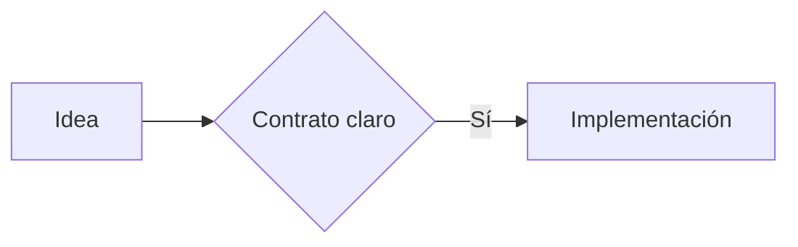

For a standalone engineering report rather than a workflow artifact, read
`report-reference.md` and use the shared report helper. Continue below for a
Working Backwards initiative.

# Working Backwards in T3 Code

Start with a non-technical Product Grill With Docs, then work backwards from the finished customer experience. Accept an ordinary sentence; never require a structured mega-prompt. T3 Code is the conversational and execution surface. HumanLayer is not required.

## Create the workspace

Resolve the Git repository root, normalized remote, and exact `git rev-parse HEAD`. Derive short path-safe repository and feature slugs. Use the repository's configured private planning root when one exists; otherwise create outside Git under the operator HOME:

```text
~/.development-system/private/working-backwards/<repository-slug>-<feature-slug>/
```

Use that exact feature-specific directory as `workspaceDir`. Never place this workspace in a synchronized, published, or Git-tracked path. Markdown is the canonical agent-readable source. The helper derives a plain Reader model from Markdown plus workflow-state JSON, regenerates one current `<initiative-slug>.html`, and renders every available artifact under `reader-history/` with the same visual system. Do not author feature-specific HTML, Canvas, Agent Native, or Integrar artifacts.

Run the installed helper before acting:

```text
node <skill-dir>/scripts/t3-workflow.mjs status \
  --workspace-dir <absolute-workspace-dir> \
  --repository-path <absolute-repository-root> \
  --repository-identity <remote> \
  --repository-revision <revision>
```

Its `currentPhase` and `action` are authoritative. After creating or revising an artifact, regenerate the Reader:

```text
node <skill-dir>/scripts/t3-workflow.mjs render \
  --workspace-dir <absolute-workspace-dir> \
  --repository-path <absolute-repository-root> \
  --repository-identity <remote> \
  --repository-revision <revision>
```

After each substantive render, start or refresh the bounded local review surface:

```text
node <skill-dir>/scripts/reader-live.mjs \
  --workspace <absolute-workspace-dir> \
  --reader <initiative-slug>.html \
  --ttl-minutes 120
```

Return its localhost URL, the Reader file link, and the active Markdown file. Keep the yielded process/session so it can be stopped when the user finishes reviewing. If the user says they are away, on another computer, or otherwise cannot reach localhost, add `--tunnel`. Return the tokenized temporary URL and its expiry. This is explicit remote-review authorization for that one private workspace only; it is not authorization to publish, index, sync, or retain planning content. Stop the process when the user says they reviewed it, when the workflow is abandoned, or at TTL expiry.

## Run one document at a time

Use exactly this order for the Standard profile:

1. `product-grill`: Product Grill With Docs by Topic. Settle actor, problem, desired outcome, future experience, boundaries, and expectations. Do not design entities, interfaces, storage, or architecture here.
2. `customer-story`: a compact, non-technical future customer narrative derived from the approved Product Grill.
3. `technical-grill`: Technical Grill With Docs driven by the approved story, selected profile, repository evidence, and risk triggers. Settle behavior, entities, states, interfaces, data, security, testing, rollout, and technical trade-offs without repeating product Topics.
4. `research-questions`: only questions about current behavior, code, users, or external facts still unresolved after the Technical Grill.
5. `research-report`: live code/runtime and primary-source answers, with facts, inferences, and unknowns separated.
6. `product-contract`: observable behavior, scope, success, states, permissions, errors, recovery, compatibility, and rejected product options.
7. `technical-contract`: entities, invariants, interfaces, reads, writes, events, migrations, security, rollback, test seams, and rejected technical options.
8. `implementation-map`: narrow vertical tickets with outcome, acceptance, checks, dependencies, and one truthful executable frontier.
9. `t3-handoff`: compact private handoff bound to the approved artifacts and exact first slice; `implementationAuthorized: false`.

Create numbered Markdown files with these stems:

```text
01-product-grill.md
02-customer-story.md
03-technical-grill.md
04-research-questions.md
05-research-report.md
06-product-contract.md
07-technical-contract.md
08-implementation-map.md
```

Every canonical artifact starts with:

```yaml
---
working_backwards_role: <role>
working_backwards_status: draft
title: <short document title>
summary: <one or two sentence settled summary>
---
```

The implementation map also declares `working_backwards_first_slice: <ticket-id>` and contains that exact ticket with satisfied dependencies and an executable acceptance path.

Create or revise exactly one artifact at a time. Begin from the user's ordinary sentence and draft the first useful version yourself. Ask only when an unresolved decision can change the active document; inspect repository facts and use settled conversation context instead of asking the user to repeat discoverable information. Write every settled answer into that Markdown, keep the document concise, and regenerate `<initiative-slug>.html`. Remain on the active document until the user clearly approves it.

### Ask by Topic

Keep one Topic per turn. Within that Topic, batch `1–3` mutually related decisions when answering them together reduces back-and-forth. Ask only one when only one meaningful decision remains. Never combine different Topics merely to fill the tool.

Compose the round through the installed helper:

```text
node <skill-dir>/scripts/topic-questions.mjs \
  --input <absolute-topic-json> \
  --format both
```

The input contains one `topic`, optional `settledContext`, and `1–3` `decisions`. Each decision has a stable snake-case `id`, a short header, the question, and `2–3` mutually exclusive options. Each option supplies a short label, its impact or trade-off, a concrete example, and exactly one option is marked `recommended: true`. The helper orders the recommendation first, labels it `(Recommended)`, and emits both interfaces from the same source.

- When `request_user_input` is available in the active collaboration mode, call it with the helper's exact `native` payload.
- When it is unavailable, send the helper's exact `chat` fallback. Do not improvise a different set of options.
- The client supplies a free-form Other choice for the native interface; the chat fallback explicitly accepts a different option or added nuance.
- After the reply, persist the selected decisions, rationale, changed assumptions, and remaining unknowns in the active Markdown before moving to the next Topic.
- If the answer changes the Topic map, add, remove, or reorder later Topics openly. Do not silently preserve stale questions.

The helper is a deterministic composer, not a source of product judgment. The agent still chooses the relevant Topic, recommendation, trade-offs, and examples from current evidence.

Write settled plans, not transcripts. Prefer a short summary followed by `3–8` descriptive sections. Keep the evidence needed to understand or approve the decision; move raw logs and exhaustive source notes to referenced evidence files. Never compress away scope, acceptance criteria, risks, decisions, dependencies, or unknowns.

For a broad initiative with named workstreams, preserve those workstream names as a coverage ledger in every later artifact. Each workstream must be marked `covered`, `unchanged`, `deferred with reason`, or `blocked with evidence`. A Research Report answers residual questions; it never silently replaces the broader Product Grill, story, or convergence scope. The Reader's current page must therefore remain understandable as one phase of the whole initiative.

On every user reply while `action: review-artifact`, pass the entire message to:

```text
node <skill-dir>/scripts/t3-workflow.mjs turn \
  --workspace-dir <absolute-workspace-dir> \
  --repository-path <absolute-repository-root> \
  --message <entire-user-message> \
  --repository-identity <remote> \
  --repository-revision <revision>
```

Only `approval.accepted: true` advances. Ordinary natural-language approval is sufficient for the one active artifact; the user never has to memorize a phrase. A direct affirmation such as `está muy bien`, `me gusta`, `todo correcto`, `perfecto todo aquí`, or `sí` is sufficient. So is a clear no-change statement paired with normal movement language, for example `no tengo cambios, sigue`, `por mí está bien, vamos a la siguiente fase`, `ya quedó, dale`, or `continúa con el siguiente documento`. Feedback revises the same file. Questions, negation, ambiguity, reported approval, combined gates, or a reply that also asks for changes never advance. When affirmation and requested changes coexist, feedback wins: revise the artifact and present its new bytes for approval again.

Product-convergence prompts may explicitly opt into a reference pack and ask the Technical Grill to infer architecture choices that repository evidence settles. That is prompt-local behavior, not the default for ordinary or complex Working Backwards work.

### Architecture-convergence program

When an opted-in product-convergence prompt requests a repository-wide architecture program, add `working_backwards_program: architecture-convergence` to the Technical Grill frontmatter and load the canonical architecture reference pack. The Grill must include the reference pack's complete `Dimension | Current evidence | Decision | Enforcement` matrix for all of these identifiers:

`repository-map`, `module-boundaries`, `dependency-direction`, `file-placement`, `frontend-composition`, `component-design`, `backend-contracts`, `type-contracts`, `testing-strategy`, `documentation`, `performance-security`, `observability`, and `migration-sequencing`.

Do not infer that a repository is understandable merely because its top-level apps have names. Inspect representative paths, imports, public Interfaces, runtime boundaries, tests, docs, generated code, compatibility surfaces, provider adapters, and automation. For components and modules, judge cohesion, responsibility, state ownership, dependency direction, Interface depth, and reuse by proven invariant; never invent a universal line-count limit. For Convex, cover queries, mutations, actions, validators, authorization, indexes, pagination, bounded reads, subscriptions, contention, scheduling, storage, maintained components, and provider adapters.

Agent guardrails, global anti-slop policy, and Release Train design belong to the Development System. Product convergence may verify the installed repository adapter and the product commands it declares, but it must not create product migration workstreams or tickets to redesign those capabilities. Product-specific documentation still explains domain ownership and file/test locality; release execution evidence may appear in the final delivery report without making Release Train part of the architecture migration.

An incomplete matrix fails closed at Technical Grill approval. A row marked `unproven` creates a focused research obligation. Every `change`, `remove`, and unresolved `unproven` row must remain traceable through Product Contract, Technical Contract, and Implementation Map to an executable ticket, an evidence-backed no-change conclusion, or a blocking human gate. Research about one provider or hotspot never replaces the repository-wide architecture program.

After an approval, say plainly:

> Terminamos **<documento>**. Siguiente: **<documento siguiente>**.

Then create only the next artifact. Draft it from the approved evidence already available and ask its first high-leverage question only if one remains. Do not dump the remaining process into chat.

## Use the shared technical Reader

The generated `<initiative-slug>.html` is the current-phase entrypoint. Every available prior artifact also has a full Reader page under `reader-history/`; the artifact rail links to those rendered pages, not raw Markdown. Every page states `Fase X de 9` and explains that it is one part of the wider initiative. The format is static, escaped, responsive, offline-capable, and `noindex`. It shows:

- a compact artifact/phase rail and source links;
- one continuous `760–900px` technical document;
- an active `On this page` outline from descriptive headings;
- restrained title, summary, status, priority, profile, reading time, dates, and repository metadata;
- the next action and exact human gate in plain language;
- first-class diagrams, code, tables, decisions, risks, testing, and rollout evidence;
- `implementationAuthorized: false` until a separate Implement Preview.

On narrow screens, the document comes first and artifact/outline navigation becomes secondary controls. The Reader model is plain JSON derived from canonical Markdown and workflow state. Other local development-system surfaces may reuse the same renderer by supplying that model; Working Backwards does not create another presentation system.

Use the Markdown itself to request richer review blocks. They remain canonical
source and the shared renderer turns them into safe local visuals:

````markdown


```chart
{"type":"bar","title":"Confianza por fase","labels":["Historia","Contrato","Tickets"],"values":[35,72,94]}
```

```typescript
export const outcome = "visible";
```
````

The renderer embeds the pinned official Mermaid runtime and supports its diagram families, including flowchart, Gantt/progress, sequence, timeline, and architecture, without a home-grown parser. Diagrams provide inline, expanded, and fullscreen reading states; drag/pan, wheel or trackpad movement, pinch, zoom, fit, reset, copy, and source inspection. Fit preserves a readable Mermaid scale; wide diagrams use the available viewport and pan or scroll horizontally instead of shrinking labels into an unreadable overview. Local bar or line charts use explicit JSON and retain an accessible data table. Semantic Markdown tables, sparse callouts, and fenced code/diff blocks preserve filename, language, copy, optional line numbers, highlights, wrapping, and clean horizontal scrolling. Prefer the diagram family that matches the relationship and use a chart only for real comparative or sequential data. Never fabricate metrics.

When a final implementation report is requested, make it review-complete rather than a link index. Render the full text or clearly separated Reader sections for every product-convergence prompt or handoff the user explicitly asked to review. Include a **Known issues** table with one row per issue, a disposition of `fixed`, `remaining`, or `authorization-blocked`, and concrete evidence. Links may support those sections but never replace their reviewable content.

Keep the Reader self-contained. Do not add CDN, remote fonts, analytics, hosted rendering, or runtime network dependencies. Never send private planning content outside the operator machine except through the bounded, tokenized, expiring tunnel above when the user has indicated remote review. Do not polish per-feature HTML: improve the shared renderer when the default format needs to change.

## Preserve the three gates

The first three documents use document approval. Hold exactly three formal definition gates:

- `product-contract` -> `approve-product-contract`
- `technical-contract` -> `approve-technical-contract`
- `implementation-map` -> `approve-implementation-map`

The helper persists canonical, hash-bound receipts privately under `~/.development-system/private/working-backwards/<workflow-id>/`. It also binds the absolute repository root, exact Git revision, and approved first slice. Repository or artifact drift returns to the earliest affected checkpoint. Implement Preview and every delivery operation re-read Git HEAD and fail closed when it no longer matches; the requested terminal slice must equal the approved first slice. A stale or concurrent lifecycle operation fails closed.

At `create-private-handoff`, write the final handoff only to the helper's `privateHandoffPath`. Populate its required binding frontmatter from `workflowId`, `gateReceiptPath`, repository evidence, all three receipt hashes, the implementation-map hash, and the exact first slice. Run `render` again. Only `action: handoff-ready` proves the handoff matches the approved planning state.

## Stop before implementation

Default to Standard. Use Quick only for settled, narrow, reversible behavior on one surface. Use Complex for invariants, authorization, sensitive data, destructive behavior, migration/backfill, paid activation, uncertain providers, multiple repositories, or difficult rollback.

This workflow defines work; it does not execute it. Do not implement, publish tracker tickets, commit, push, open a PR, merge, release, deploy, spend money, or perform destructive operations. When `handoff-ready`, tell the user:

> Working Backwards terminó. El primer slice es **<ticket-id>**. Para implementarlo en una sesión fresca de T3 Code, abre el handoff y solicita un **Implement Preview**.
